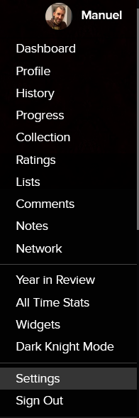
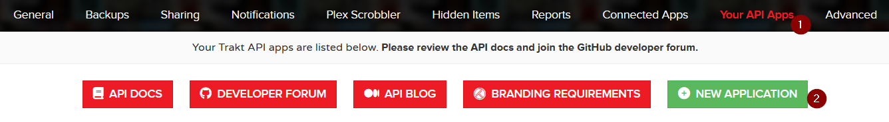
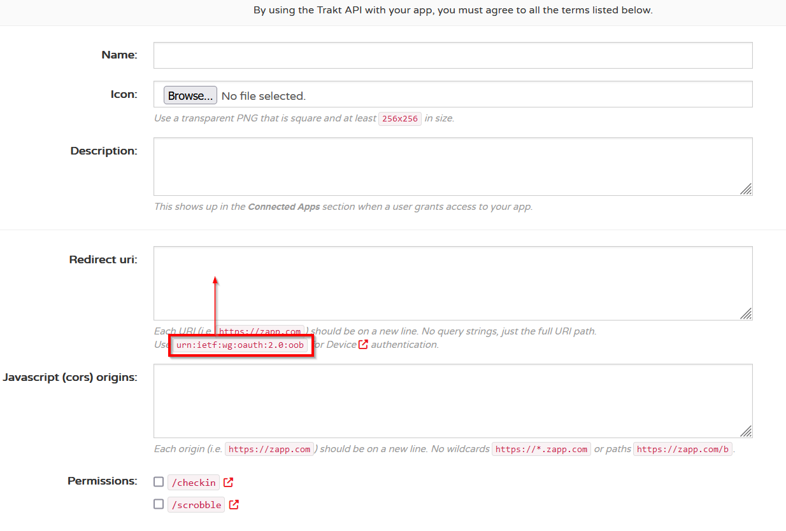
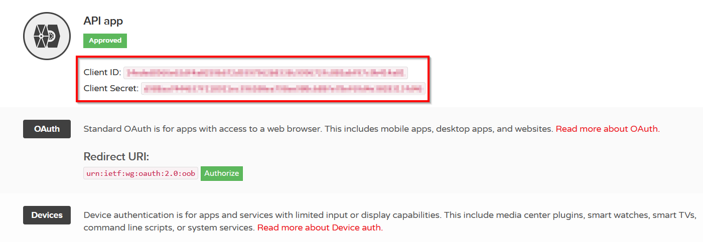

# Generate view history report
The tool can be used to generate a report of the view history of a user.

## Configuration file
The configuration of the tool can be set by modifying the parameters.json file accordingly.

* **trakt**: information regarding the tenant addressed by the scripts:
  * **clientId**: the "Client ID" for the app provided in the "Settings" -> "Your API Apps" page
  * **clientSecret**: the "Client Secret" for the app provided in the "Settings" -> "Your API Apps" page
  * **username**: the username of the targeted user (i.e. what comes after the "https://trakt.tv/users/" URL when seeing a user's profile)
  * **accessToken**: the access token generated the first time this tool is authenticated to Trakt
* **data**: parameters for the download process:
  * **outputCsvReportFileName**: the name of the output file

## How to generate the Client ID and Client Secret pair
To interact with Trakt using applications, we first need to generate secrets to authenticate against.

* Go to the Settings page under the user menu
  
  
* Select "Your API Apps" and then add a new application by selecting "New Application"
  
  
* Give the application a name, possibly a description and an image, set "urn:ietf:wg:oauth:2.0:oob" as "Redirect uri", and finally press "Save App".
  
  
* When clicking onto the app, the "Client ID" and "Client Secret" are displayed
  
  

The first time the script is launched, it will require the user to go to the Trakt website and to insert a validation code, to grant the access to the app.
The script will keep waiting for the user's confirmation, and it will move forward automatically when done.
The generated access token (valid for 3 months) will be displayed in the logs, and can be placed in the parameters.json to avoid to re-authenticate each time.
The re-authentication will be anyway needed after the token expires.